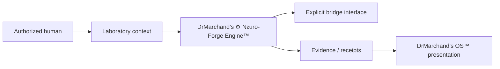

# DrMarchand’s ⚙︎ Nɛuro-Forge Engine™

> The bounded execution and orchestration layer used by DrMarchand’s Laboratory to turn validated definitions into reproducible work.

**Repository coordinate:** `DrMarchand/NFE` · **Public source surface** · **Not self-authorizing**

## What lives here

| Surface | Purpose |
| --- | --- |
| [`Engine/`](Engine/) | Engine primitives and execution-oriented modules |
| [`core/`](core/) | Shared system and runtime code |
| [`runtime/`](runtime/) | Runtime-facing components and state helpers |
| [`ORCHARD/`](ORCHARD/) | Design Orchard integration context |
| [`archive/`](archive/) | Historical material retained for provenance |
| [`RIGHTS.md`](RIGHTS.md) | Repository rights and authority boundary |

A directory name proves presence only. Deployment, production health, encryption, custody, and runtime completion require separate evidence.

## Execution boundary

The Engine may execute, validate, and orchestrate within delegated permission. It does **not** define company authority, make itself sovereign, or absorb external services as internal components.

**DrMarchand’s OS™ remains separate.** The OS presents and routes state; the Engine performs execution work.

## Source map

- [`Engine/core.py`](Engine/core.py) - current Python Engine entry-oriented source.
- [`core/system/runtime/forge_watcher.py`](core/system/runtime/forge_watcher.py) - runtime observation logic currently checked into the public source tree.

No universal install or production-run command is documented here because the repository does not currently expose one checked-in manifest that proves a single supported execution path across the whole tree.

## Public source boundary

Public code should avoid credentials, private device identities, private storage locators, account-specific paths, and unpublished production markers. Machine identifiers that must remain for compatibility should be treated as implementation coordinates, not product names.

## Authority and rights

**Legal and operating company:** Design Orchard LLC  
**Operating environment:** 🔬 DrMarchand’s Lab⚛︎ratory™

See [`RIGHTS.md`](RIGHTS.md). Existing file-specific licenses and third-party rights remain controlling.
